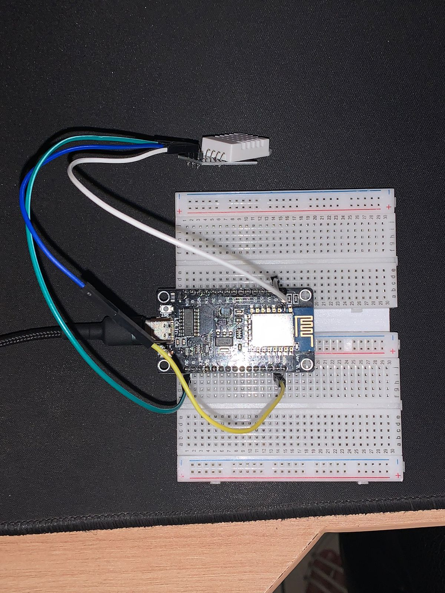
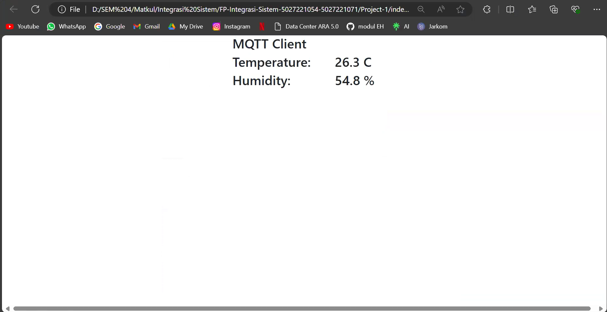
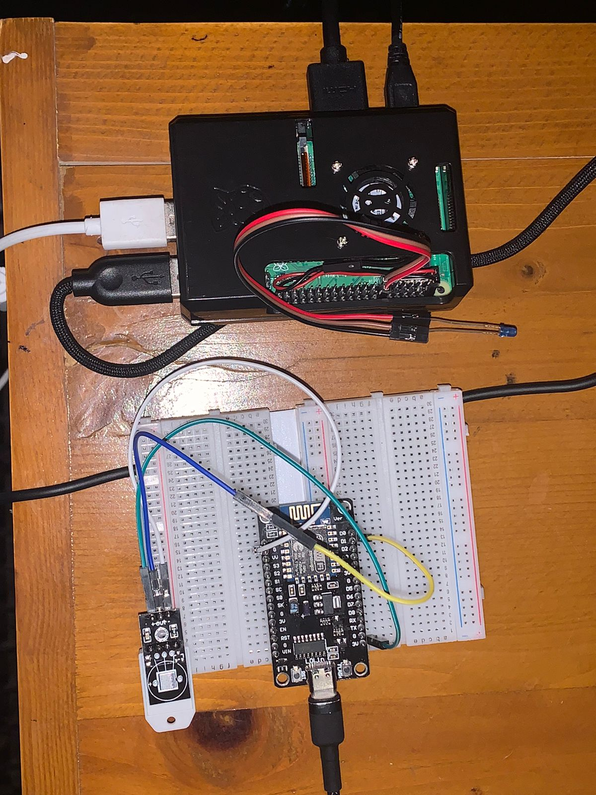
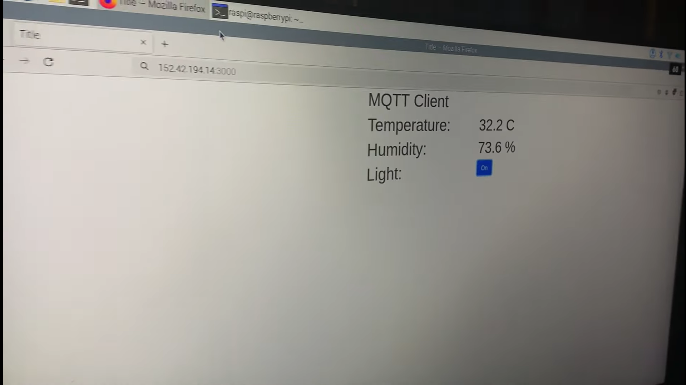

# Final Prjocet Integrasi Sistem A - Kelompok 3

| Nama              | NRP        |
| ----------------- | ---------- |
| Alma Amira Dewani | 5027221054 |
| Khansa Adia Rahma | 5027221071 |

## Video Pengerjaan

Link youtube dapat diakses di https://youtu.be/FoBcejMRXw0

## Project 1

### Alat yang Digunakan

- Sensor DHT22
- ESP 8266
- Breadboard
- Kabel jumper

### Setup Code

```
#include <Adafruit_Sensor.h>
#include <DHT.h>
#include <DHT_U.h>
#include <WiFi.h>
#include <ESP8266WiFi.h>
#include <PubSubClient.h>


// Update these with values suitable for your network.

const char* ssid = "bee";
const char* pswd = "ehvb2222";

const char* mqtt_server = "167.172.87.186"; //Broker IP/URL
const char* topic = "/kelompok3/room/temperature";

long timeBetweenMessages = 1000 * 20 * 1;

WiFiClient espClient;
PubSubClient client(espClient);
long lastMsg = 0;
int value = 0;

int status = WL_IDLE_STATUS;     // the starting Wifi radio's status


#define DHTPIN 5     // Digital pin connected to the DHT sensor

// Uncomment the type of sensor in use:
#define DHTTYPE    DHT11
//#define DHTTYPE    DHT22     // DHT 22 (AM2302)


DHT_Unified dht(DHTPIN, DHTTYPE);

uint32_t delayMS;


void setup_wifi() {
  delay(10);
  // We start by connecting to a WiFi network
  Serial.println();
  Serial.print("Connecting to ");
  Serial.println(ssid);
  WiFi.begin(ssid, pswd);
  while (WiFi.status() != WL_CONNECTED) {
    delay(500);
    Serial.print(".");
  }
  Serial.println("");
  Serial.println("WiFi connected");
  Serial.println("IP address: ");
  Serial.println(WiFi.localIP());
}

void callback(char* topic, byte* payload, unsigned int length) {
  Serial.print("Message arrived [");
  Serial.print(topic);
  Serial.print("] ");
  for (int i = 0; i < length; i++) {
    Serial.print((char)payload[i]);
  }
  Serial.println();

  // Switch on the LED if an 1 was received as first character
  if ((char)payload[0] == '1') {
    digitalWrite(BUILTIN_LED, LOW);   // Turn the LED on (Note that LOW is the voltage level
    // but actually the LED is on; this is because
    // it is acive low on the ESP-01)
  } else {
    digitalWrite(BUILTIN_LED, HIGH);  // Turn the LED off by making the voltage HIGH
  }
}

String macToStr(const uint8_t* mac)
{
  String result;
  for (int i = 0; i < 6; ++i) {
    result += String(mac[i], 16);
    if (i < 5)
      result += ':';
  }
  return result;
}

String composeClientID() {
  uint8_t mac[6];
  WiFi.macAddress(mac);
  String clientId;
  clientId += "esp-";
  clientId += macToStr(mac);
  return clientId;
}

void reconnect() {
  // Loop until we're reconnected
  while (!client.connected()) {
    Serial.print("Attempting MQTT connection...");

    String clientId = composeClientID() ;
    clientId += "-";
    clientId += String(micros() & 0xff, 16); // to randomise. sort of

    // Attempt to connect
    if (client.connect(clientId.c_str())) {
      Serial.println("connected");
      String subscription;
      subscription += topic;
      subscription += "/";
      subscription += composeClientID() ;
      subscription += "/in";
      client.subscribe(subscription.c_str() );
      Serial.print("subscribed to : ");
      Serial.println(subscription);
    } else {
      Serial.print("failed, rc=");
      Serial.print(client.state());
      Serial.print(" wifi=");
      Serial.print(WiFi.status());
      Serial.println(" try again in 5 seconds");
      // Wait 5 seconds before retrying
      delay(5000);
    }
  }
}


void setup() {
  Serial.begin(115200);
  // Initialize device.
  dht.begin();

  //Setup WIFI & MQTT Broker connection
  setup_wifi();
  client.setServer(mqtt_server, 1883);
  client.setCallback(callback);

  Serial.println(F("DHTxx Unified Sensor Example"));
  // Print temperature sensor details.
  sensor_t sensor;
  dht.temperature().getSensor(&sensor);
  Serial.println(F("------------------------------------"));
  Serial.println(F("Temperature Sensor"));
  Serial.print  (F("Sensor Type: ")); Serial.println(sensor.name);
  Serial.print  (F("Driver Ver:  ")); Serial.println(sensor.version);
  Serial.print  (F("Unique ID:   ")); Serial.println(sensor.sensor_id);
  Serial.print  (F("Max Value:   ")); Serial.print(sensor.max_value); Serial.println(F("°C"));
  Serial.print  (F("Min Value:   ")); Serial.print(sensor.min_value); Serial.println(F("°C"));
  Serial.print  (F("Resolution:  ")); Serial.print(sensor.resolution); Serial.println(F("°C"));
  Serial.println(F("------------------------------------"));
  // Print humidity sensor details.
  dht.humidity().getSensor(&sensor);
  Serial.println(F("Humidity Sensor"));
  Serial.print  (F("Sensor Type: ")); Serial.println(sensor.name);
  Serial.print  (F("Driver Ver:  ")); Serial.println(sensor.version);
  Serial.print  (F("Unique ID:   ")); Serial.println(sensor.sensor_id);
  Serial.print  (F("Max Value:   ")); Serial.print(sensor.max_value); Serial.println(F("%"));
  Serial.print  (F("Min Value:   ")); Serial.print(sensor.min_value); Serial.println(F("%"));
  Serial.print  (F("Resolution:  ")); Serial.print(sensor.resolution); Serial.println(F("%"));
  Serial.println(F("------------------------------------"));
  // Set delay between sensor readings based on sensor details.
  delayMS = 30000;
}

void loop() {
  // Delay between measurements.
  delay(delayMS);
  // Get temperature event and print its value.
  sensors_event_t event;
  dht.temperature().getEvent(&event);
  float temp=0;
  if (isnan(event.temperature)) {
    Serial.println(F("Error reading temperature!"));
  }
  else {
    Serial.print(F("Temperature: "));
    Serial.print(event.temperature);
    Serial.println(F("°C"));
    temp=event.temperature;
  }


  // Get humidity event and print its value.
  dht.humidity().getEvent(&event);
  float hum=0;
  if (isnan(event.relative_humidity)) {
    Serial.println(F("Error reading humidity!"));
  }
  else {
    Serial.print(F("Humidity: "));
    Serial.print(event.relative_humidity);
    Serial.println(F("%"));
    hum=event.relative_humidity;
  }


    // confirm still connected to mqtt server
  if (!client.connected()) {
    reconnect();
  }
  client.loop();

  String payload = "{\"Temp\":";
  payload += temp;
  payload += ",\"Hum\":";
  payload += hum;
  payload += "}";
  String pubTopic;
   pubTopic += topic;
  Serial.print("Publish topic: ");
  Serial.println(pubTopic);
  Serial.print("Publish message: ");
  Serial.println(payload);
  client.publish( (char*) pubTopic.c_str() , (char*) payload.c_str(), true );

  delay(5000);
}
```

### Testing

- setup alat
  

- hasil
  

## Project 2

### Alat yang Digunakan

- Raspebrry Pi
- Sensor DHT22
- ESP 8266
- Breadboard
- Kabel jumper
- LED

### Kode

- Pub

```
import paho.mqtt.client as mqtt
import json

def on_connect(client, userdata, flags, rc):
    # subscribe, which need to put into on_connect
    # if reconnect after losing the connection with the broker, it will continue to subscribe to the raspberry/topic topic
    client.subscribe("/kelompok3/room/temperature")

# the callback function, it will be triggered when receiving messages
def on_message(client, userdata, message):
    readings=str(message.payload.decode("utf-8"))
    print("message received " ,readings)
    JsonReadings=json.loads(readings)
    print("Temperature=",JsonReadings["Temp"])
    if JsonReadings["Temp"]>15:
        client.publish("/kelompok3/room/led","On")
    else:
        client.publish("/kelompok3/room/led","Off")

client = mqtt.Client()
client.on_connect = on_connect
client.on_message = on_message
# create connection, the three parameters are broker address, broker port number, and keep-alive time respectively
# client.username_pw_set(username="",password="")
client.connect("167.172.87.186", 1883, 60)
# set the network loop blocking, it will not actively end the program before calling disconnect() or the program crash
client.loop_forever()
```

- Sub

```
import paho.mqtt.client as mqtt
import RPi.GPIO as GPIO # Import Raspberry Pi GPIO library
from time import sleep # Import the sleep function from the time module

GPIO.setwarnings(False) # Ignore warning for now
GPIO.setmode(GPIO.BOARD) # Use physical pin numbering
GPIO.setup(12, GPIO.OUT, initial=GPIO.LOW) # Set pin 8 to be an output pin and$

def on_connect(client, userdata, flags, rc):
    # subscribe, which need to put into on_connect
    # if reconnect after losing the connection with the broker, it will continue to subscribe to the raspberry/topic topic
    client.subscribe("/kelompok3/room/led")

# the callback function, it will be triggered when receiving messages
def on_message(client, userdata, message):
    if str(message.payload.decode("utf-8"))=="On":
        GPIO.output(12, GPIO.HIGH) # Turn on
    else:
        GPIO.output(12, GPIO.LOW) # Turn Off
    print("message received " ,str(message.payload.decode("utf-8")))

client = mqtt.Client()
client.on_connect = on_connect
client.on_message = on_message
# create connection, the three parameters are broker address, broker port number, and keep-alive time respectively
# client.username_pw_set(username="",password="")
client.connect("167.172.87.186", 1883, 60)
# set the network loop blocking, it will not actively end the program before calling disconnect() or the program crash
client.loop_forever()
```

### Testing

- setup alat
  

- testing
  
